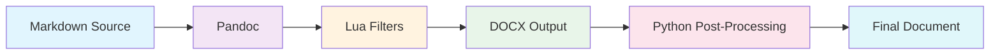
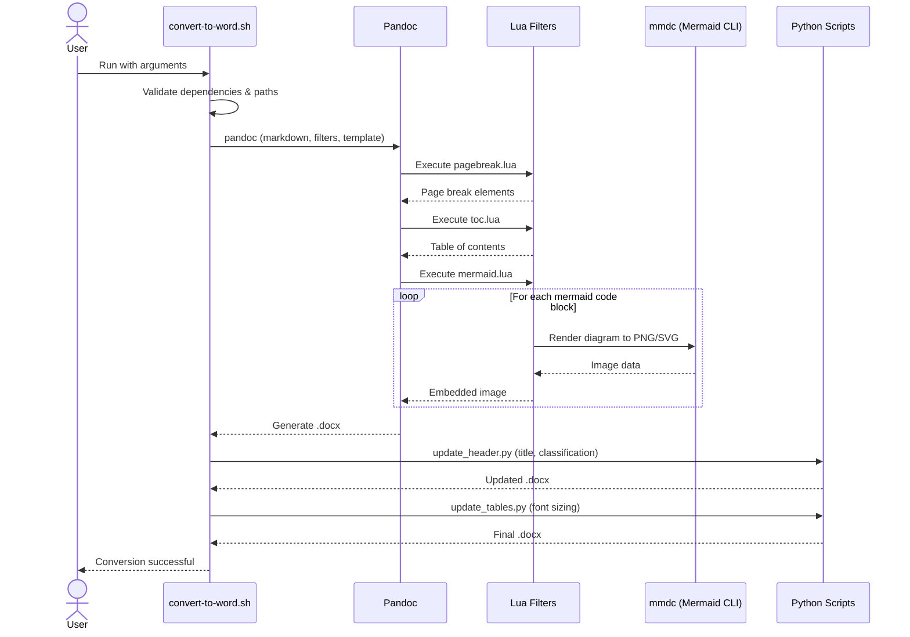
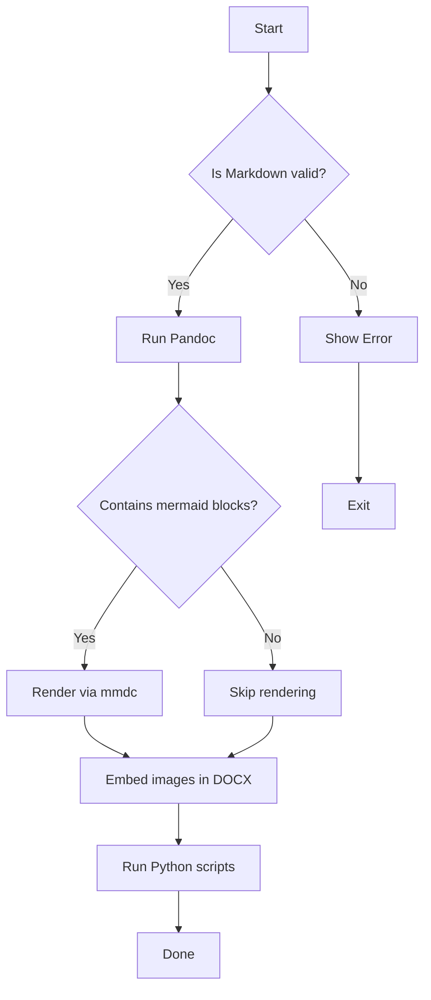
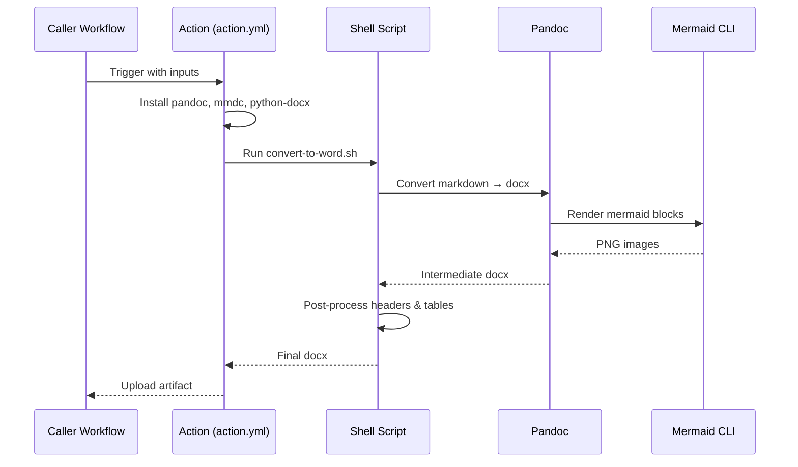
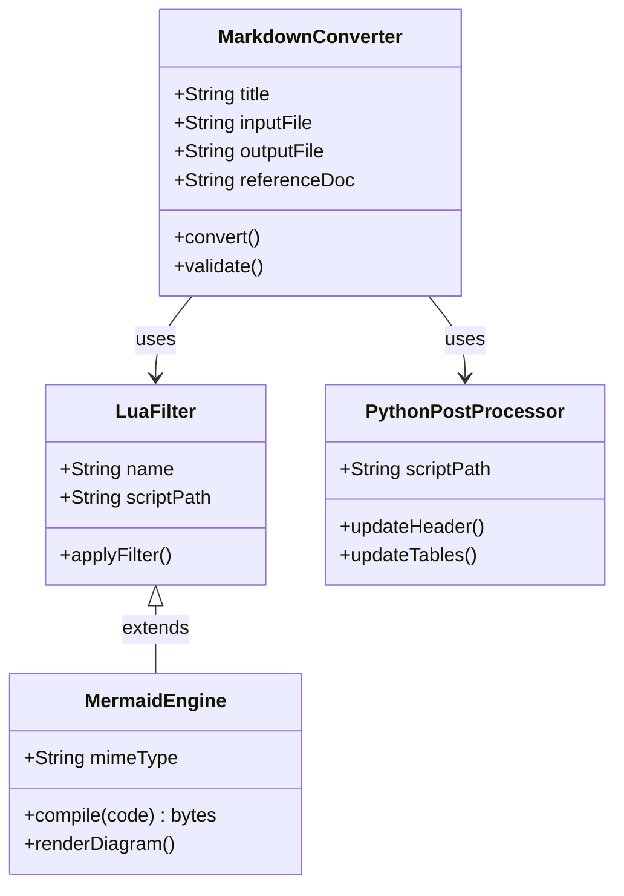
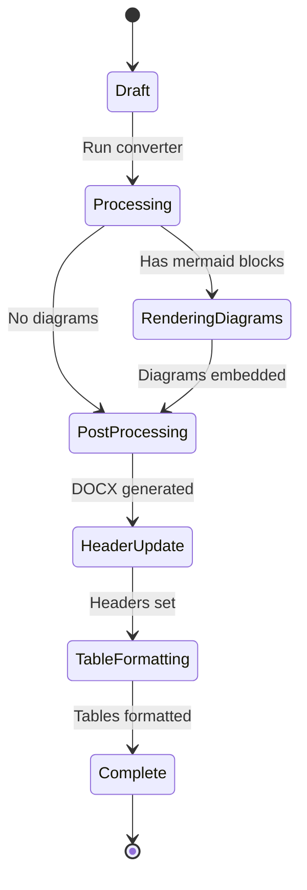
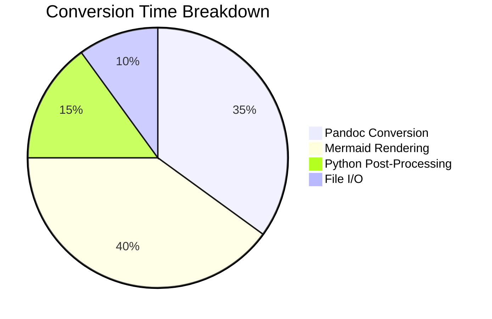
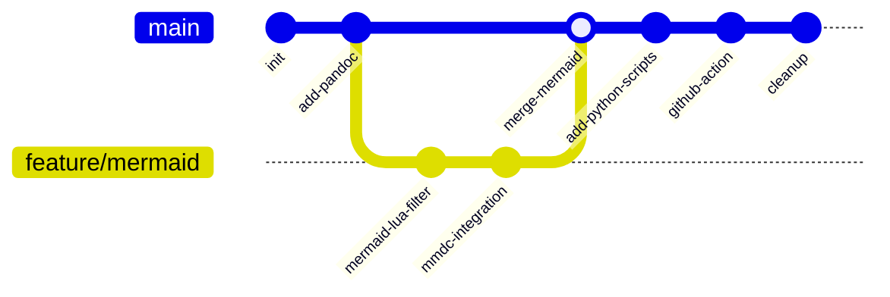
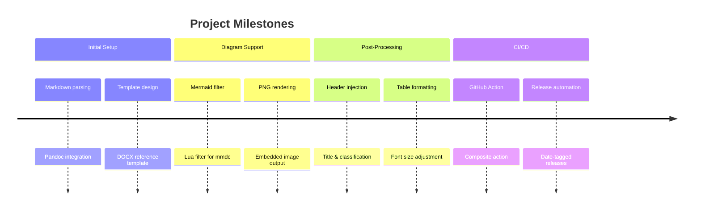

\newpage

::: {#toc}
:::

\newpage

# Overview

The **Markdown to Word Converter** transforms Markdown documents into professionally formatted Word documents (`.docx`) using Pandoc, with support for embedded Mermaid diagrams, custom table styles, and automated document metadata.

This document serves as both a technical reference and a demonstration of the converter's capabilities.

## Key Features

- **Pandoc-powered conversion** with a custom DOCX reference template
- **Mermaid diagram rendering** — flowcharts, sequence diagrams, class diagrams, and more
- **Custom table styles** from the Word template
- **Automated header metadata** — title and classification replacement
- **Table of contents generation** from a placeholder directive
- **Section numbering** via an optional flag
- **GitHub Action** for CI/CD integration

\newpage

# Architecture

The conversion pipeline processes Markdown through several stages to produce a final Word document.



Each stage applies specific transformations:

| Stage | Tool | Purpose |
|-------|------|---------|
| Markdown Source | — | Author writes content in Markdown |
| Pandoc | `pandoc` | Parses Markdown and applies reference template |
| Lua Filters | `pagebreak.lua`, `toc.lua`, `mermaid.lua` | Handle page breaks, TOC, and diagram rendering |
| DOCX Output | — | Intermediate Word document |
| Python Post-Processing | `update_header.py`, `update_tables.py` | Set header metadata, format tables |
| Final Document | — | Production-ready `.docx` file |

\newpage

# How It Works

The following sequence diagram shows how components interact during a conversion.



## Processing Details

1. **Dependency Check** — The script verifies that `pandoc`, `python3`, `python-docx`, and `mmdc` are installed
2. **Path Resolution** — Relative paths are resolved against the workspace root
3. **Pandoc Conversion** — The reference template (`.dotx`) provides base styling, fonts, headers, and footers
4. **Lua Filters** run sequentially on the document AST
5. **Python Post-Processing** modifies the DOCX directly via `python-docx` and `zipfile`

\newpage

# Mermaid Diagram Examples

The `mermaid.lua` filter renders any `` ```mermaid `` code block as an embedded image. Below are the supported diagram types.

## Flowchart



## Sequence Diagram



## Class Diagram



## State Diagram



## Pie Chart



## Git Graph



## Timeline



\newpage

# Custom Table Styles

The Word template includes custom table styles that can be applied using fenced div syntax.

## Standard Table

| Feature | Status | Notes |
|---------|--------|-------|
| Mermaid flowcharts | Supported | Rendered via `mmdc` |
| Mermaid sequence diagrams | Supported | Full interaction support |
| Mermaid class diagrams | Supported | UML class notation |
| Mermaid state diagrams | Supported | v2 syntax supported |
| Mermaid pie charts | Supported | Data visualization |
| Mermaid git graphs | Supported | Branch/merge visualization |
| Mermaid timelines | Supported | Chronological display |

## Custom-Styled Table

::: {custom-style="GridTable5Dark-Accent2"}

| Input | Required | Default | Description |
|-------|----------|---------|-------------|
| `default_title` | Yes | — | Title for the Word document |
| `markdown_file` | Yes | — | Path to the Markdown source file |
| `output_file` | No | `output/output.docx` | Path for the output DOCX |
| `reference_doc` | No | `template/ssc-template-v2.7.dotx` | Word template for styling |
| `classification` | No | `Unclassified \| Non classifie` | Header classification text |
| `number_sections` | No | `false` | Add section numbers to headings |

::

## Another Custom-Styled Table

::: {custom-style="GridTable5Dark-Accent2"}

| Component | File | Purpose |
|-----------|------|---------|
| Shell script | `convert-to-word.sh` | Orchestrates the full conversion pipeline |
| Page break filter | `filters/pagebreak.lua` | Converts `\newpage` to docx page breaks |
| TOC filter | `filters/toc.lua` | Generates table of contents from placeholder |
| Mermaid filter | `filters/mermaid.lua` | Renders mermaid code blocks as embedded images |
| Header script | `scripts/update_header.py` | Sets title and classification in document headers |
| Table script | `scripts/update_tables.py` | Adjusts table font sizes for readability |
| Reference template | `template/ssc-template-v2.7.dotx` | Base styling for all generated documents |

::

\newpage

# GitHub Action Usage

The composite GitHub Action can be called from any workflow.

## Minimal Example

```yaml
name: Generate Document
on:
  workflow_dispatch:

jobs:
  build:
    runs-on: ubuntu-latest
    steps:
      - name: Checkout
        uses: actions/checkout@v4

      - name: Convert to Word
        uses: gccloudone/markdown-to-word@main
        with:
          default_title: "My Document"
          markdown_file: "docs/content.md"
          output_file: "output/report.docx"
```

## Full Example with All Options

```yaml
name: Generate Report
on:
  workflow_dispatch:
    inputs:
      doc_title:
        description: 'Document title'
        required: true

jobs:
  build:
    runs-on: ubuntu-latest
    steps:
      - name: Checkout
        uses: actions/checkout@v4

      - name: Convert to Word
        uses: gccloudone/markdown-to-word@main
        with:
          default_title: "${{ inputs.doc_title }}"
          markdown_file: "docs/report.md"
          output_file: "output/report.docx"
          reference_doc: "template/custom.dotx"
          classification: "CONFIDENTIAL"
          number_sections: true

      - name: Upload
        uses: actions/upload-artifact@v4
        with:
          name: report
          path: output/report.docx
```

\newpage

# Configuration Reference

## Environment Variables

The shell script supports environment variable overrides for all settings.

| Variable | CLI Position | Default | Description |
|----------|-------------|---------|-------------|
| `TITLE` | 1st arg | `[Untitled Document]` | Document title |
| `MARKDOWN_FILE` | 2nd arg | `docs/sample.md` | Input markdown file |
| `OUTPUT_FILE` | 3rd arg | `output/sample.docx` | Output docx file |
| `REFERENCE_DOC` | 4th arg | `template/ssc-template-v2.7.dotx` | Reference template |
| `CLASSIFICATION` | 5th arg | `Unclassified \| Non classifie` | Header classification |
| `INPUT_NUMBER_SECTIONS` | — | `false` | Enable section numbering |

## Local Usage

```bash
# Using positional arguments
./convert-to-word.sh "My Report" docs/report.md output/report.docx

# Using environment variables
TITLE="Monthly Report" \
MARKDOWN_FILE="docs/monthly.md" \
OUTPUT_FILE="output/monthly.docx" \
./convert-to-word.sh

# With section numbering
INPUT_NUMBER_SECTIONS=true ./convert-to-word.sh
```

\newpage

# Requirements

| Dependency | Version | Purpose |
|------------|---------|---------|
| `pandoc` | 3.0+ | Core Markdown-to-DOCX conversion engine |
| `python3` | 3.6+ | Runs post-processing scripts |
| `python-docx` | latest | Python library for DOCX manipulation |
| `@mermaid-js/mermaid-cli` | latest | Renders mermaid diagrams to images (`mmdc`) |

## Installation

```bash
# Ubuntu / Debian
sudo apt-get install pandoc python3 python3-pip
pip3 install python-docx
npm install -g @mermaid-js/mermaid-cli

# macOS
brew install pandoc python3
pip3 install python-docx
npm install -g @mermaid-js/mermaid-cli
```

\newpage

# Troubleshooting

| Problem | Cause | Solution |
|---------|-------|----------|
| `pandoc: command not found` | Pandoc not installed | Install pandoc 3.0+ |
| `mmdc: command not found` | Mermaid CLI not installed | Run `npm install -g @mermaid-js/mermaid-cli` |
| `import docx` fails | python-docx not installed | Run `pip3 install python-docx` |
| Diagrams not rendering | mmdc failing silently | Check stderr output; ensure puppeteer/chromium is available |
| Title not appearing in header | Template placeholder mismatch | Verify template contains `[Enter Document Title]` |
